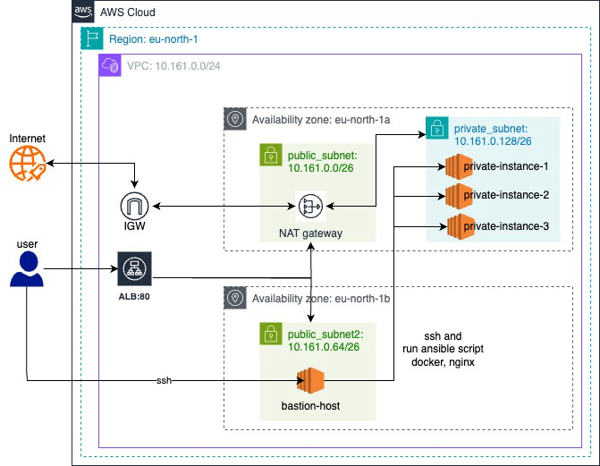

# skyLogix
SkyLogix (Cloud + Logs + Infra) Solution for the Technical code challenge

## Pre-requisites

* Terraform installed on local/remote machine
* Git installed on local/remote machine
* Virtual Studio Code or IntelliJ or any other preferred tool
* AWS account
* AWS account integrated with Virtual Studio Code with `access_key` and `secret_access_key` using `TF_VARS`
* Clone the Git repository: skyLogix

## Directory Structure


skyLogix/
├── terraform/
│ ├── main.tf
│ ├── ec2.tf
│ ├── network.tf
│ ├── alb.tf
│ ├── variable.tf
│ ├── output.tf
│ ├── iam.tf
│ └── provider.tf
└── ansible/
└── docker-nginx/
├── tasks/
│ └── main.yml
├── vars/
│ └── main.yml
├── meta/
│ └── main.yml
├── handlers/
│ └── main.yml
└── templates/
├── nginx.conf.j2
└── index.html.j2
run.sh

## `run.sh` File Paths

```bash
TERRAFORM_DIR="/skyLogix/terraform"
KEY_FILE_PEM="/skyLogix/bastion_access_key.pem"

terraform/ec2.tf File Paths
For bastion aws_instance resource:
source = "/skyLogix/bastion_access_key.pem"

At resource "local_file" "hosts_file":
filename = "/skyLogix/hosts"

At resource "null_resource" "copy_ansible_config":
source = "/skyLogix/ansible/ansible.cfg"
source = "/skyLogix/hosts"
source = "/skyLogix/ansible"

network.tf File Paths
resource "local_file" "bastion_private_key" {
  filename = "/skyLogix/bastion_access_key.pem"
}

variable.tf File
variable "allowed_ssh_cidrs" {
  type    = list(string)
  default = ["/32"] # IMPORTANT: Replace with your actual IP!
}

Architectural Design

The following architectural design is implemented to achieve the objectives:
Core Components
Terraform Provisioning:
AWS Cloud region: eu-north-1
AWS Virtual Private Cloud (VPC) with the CIDR range: 10.161.0.0/24 (256 IPs)
2 Availability Zones (AZs): eu-north-1a and eu-north-1b
2 public subnets in each of the availability zones and 1 private subnet in one availability zone.
A NAT Gateway to allow traffic from the private subnet to the internet.
An Internet Gateway to allow traffic to and from the internet to public and private subnets.
Bastion host (AWS EC2 Instance) and NAT Gateway in each public subnet, and 3 EC2 instances in the private subnet (which doesn't have access to the internet).
Application Load Balancer (ALB) applied on public subnets.
An Elastic IP is set up and configured with the NAT Gateway within the VPC.
Route table setup for both the public and private subnets for incoming and outgoing traffic.
Security Groups (SGs) and rules for the public subnet (bastion host), private subnet, and ALB.
SG rules allow the bastion host to connect to the instances in the private subnet (unidirectional).
For the EC2 instances, the OS image AMI is Amazon Linux.
SSH key pairs and a PEM file are used to SSH to the bastion host and from the bastion host to the private EC2 instances.
IAM roles and policies are established for CloudWatch logs (from private EC2 instances).
Ansible Playbook:
Installation of Docker in all private EC2 instances.
Pull, tag, run the Nginx image and create nginx-logs group from Docker Community which fetch the docker logs from private ec2-instances to Cloudwatch for live streaming of logs from Docker Community
